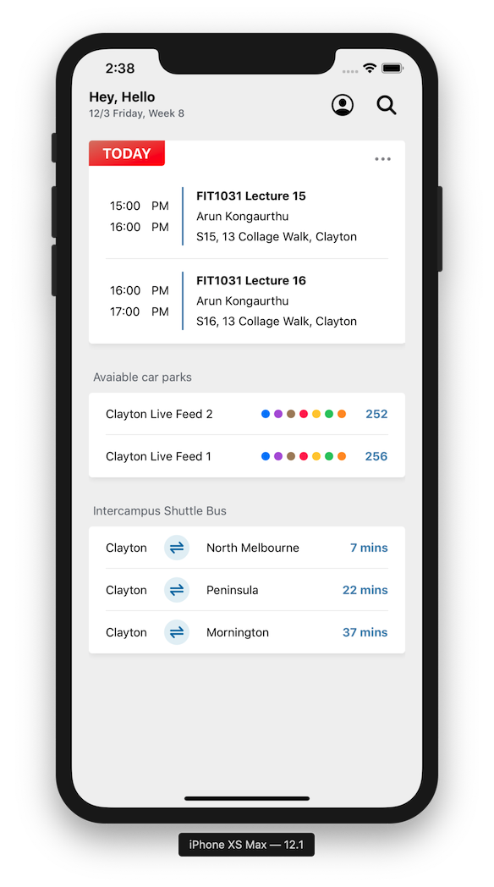
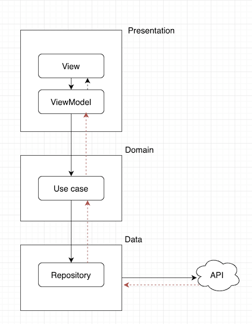

# Purpose

This is a one-screen app designed for Monash University Coding Challenge. 

The buttons on the screen are just placeholders, in another word, nothing will happen when user taps the button. Also, tapping on any of the views won't transit to other pages. The greeting message on the top left is just hardcoded value. The goal is to build up a codebase with good code reusability and good architecture.



## Getting Started

To get the app up and running on your local machine, you need to have `cocoapods` installed:

```
gem install cocoapods -v 1.7.5
```

then install the Firebase SDK dependencies by running:

```
pod install
```

Now you can open `Dashboard.xcworkspace` in XCode and press "Command + R" to run the app, or "Command + U" to run unit tests.

## Design

The app uses 3 layer design as illustrated below - black arrow shows how the message is sent from one direction to another, and brown arrow shows how the data flows back:



### Data

The data is provided by Firebase and is generated using `index.js`. 23 lectures and 23 * 4 = 92 buses have been feeded into the Firebase database, so that unless you run the app at the midnight, you will always see some lectures and buses in the app.

To simplify the date parsing logic, I'm just using a simple format of "hh:mm" for the bus time, lecture start time, and lecture end time. So only the lectures & buses within the current day will be shown, also there is no UTC & timezone calculation involved.

Please note that there is no data validation, I just assume everything stored in the database are in expected format.

### Domain

The UseCases deal with business logic and in this case, they sort, filter and set the limit of the numbers of items to be displayed.

### Presentation

Presentation is where the UI logic sits. It consists of 2 parts:

View — responsible for presenting data and interacting with user inputs. It’s implemented using UIView and UIViewController

ViewModel — getting data from Domain and sending back to ViewController

## Using the app

The number of items to be displayed on the screen is configured in Constants.swift, you can specify how many buses, lectures and car parks you want to see by changing the numbers.

You can also press `Command + U` to run all the unit tests.
